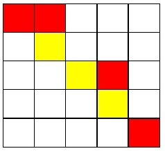
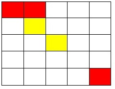

# 1416：【2017NOIP普及组】棋盘

时间限制: 1000 ms         内存限制: 131072 KB
提交数: 440     通过数: 130

## 【题目描述】

有一个m × m的棋盘，棋盘上每一个格子可能是红色、黄色或没有任何颜色的。你现在 要从棋盘的最左上角走到棋盘的最右下角。 任何一个时刻，你所站在的位置必须是有颜色的（不能是无色的） ，你只能向上、下、 左、右四个方向前进。当你从一个格子走向另一个格子时，如果两个格子的颜色相同，那你 不需要花费金币；如果不同，则你需要花费 1 个金币。 另外，你可以花费 2 个金币施展魔法让下一个无色格子暂时变为你指定的颜色。但这个 魔法不能连续使用，而且这个魔法的持续时间很短，也就是说，如果你使用了这个魔法，走 到了这个暂时有颜色的格子上，你就不能继续使用魔法；只有当你离开这个位置，走到一个 本来就有颜色的格子上的时候，你才能继续使用这个魔法，而当你离开了这个位置（施展魔 法使得变为有颜色的格子）时，这个格子恢复为无色。 现在你要从棋盘的最左上角，走到棋盘的最右下角，求花费的最少金币是多少？

## 【输入】

数据的第一行包含两个正整数 m，n，以一个空格分开，分别代表棋盘的大小，棋盘上 有颜色的格子的数量。  接下来的 n 行，每行三个正整数 x，y，c，分别表示坐标为（x，y）的格子有颜色 c。 其中 c=1 代表黄色，c=0 代表红色。相邻两个数之间用一个空格隔开。棋盘左上角的坐标 为（1, 1），右下角的坐标为（m, m）。  棋盘上其余的格子都是无色。保证棋盘的左上角，也就是（1，1）一定是有颜色的。
【输出】

输出一行，一个整数，表示花费的金币的最小值，如果无法到达，输出-1。

## 【输入样例】

5 7
1 1 0
1 2 0
2 2 1
3 3 1
3 4 0
4 4 1
5 5 0

## 【输出样例】

8

## 【提示】

### 【输入输出样例 1 说明】



从（1，1）开始，走到（1，2）不花费金币

从（1，2）向下走到（2，2）花费 1 枚金币

从（2，2）施展魔法，将（2，3）变为黄色，花费 2 枚金币

从（2，2）走到（2，3）不花费金币

从（2，3）走到（3，3）不花费金币

从（3，3）走到（3，4）花费 1 枚金币

从（3，4）走到（4，4）花费 1 枚金币 从（4，4）施展魔法，将（4，5）变为黄色，花费 2 枚金币，

从（4，4）走到（4，5）不花费金币

从（4，5）走到（5，5）花费 1 枚金币

共花费 8 枚金币。

### 【输入输出样例 2】

输入:

5 5

1 1 0

1 2 0

2 2 1

3 3 1

5 5 0

输出:

-1

【输入输出样例 2 说明



从（1，1）走到（1，2），不花费金币

从（1，2）走到（2，2），花费 1 金币

施展魔法将（2，3）变为黄色，并从（2，2）走到（2，3）花费 2 金币

从（2，3）走到（3，3）不花费金币

从（3，3）只能施展魔法到达（3，2），（ 2，3），（ 3，4），（4，3） 而从以上四点均无法到达（5，5），故无法到达终点，输出－1  

【数据规模与约定】

对于 30%的数据，1 ≤ m ≤ 5， 1 ≤ n ≤ 10。

对于 60%的数据，1 ≤ m ≤ 20， 1 ≤ n ≤ 200。

对于 100%的数据，1 ≤ m ≤ 100， 1 ≤ n ≤ 1,000。
【来源】

【题目解析】

此题可以用搜索来完成，不管是深搜还是广搜，都是可以完成的。只是深搜需要一点剪枝（即相当于记忆化）。其实，此题总体来说，并不是很难，但当时我就是在修改时，一不小心，就修改成了死循环。。。。


```c
#include<cstdio> 
#include<iostream> 
#include<cstring> 
#include<cmath> 
int x,y,c,m,n,f[1005][1005],map[1005][1005]; 
int read()        
{        
    int x=0,f=1;      
    char s=getchar();        
    while(s>'9'||s<'0') {if(s=='-') f=-1;s=getchar();}        
    while(s>='0'&&s<='9') x=x*10+s-'0',s=getchar();        
    return x*f;        
}   
void lj(int i,int j,int c,bool fl,int now) 
{ 
    if(i>m||i<1||j<1||j>m)return; 
    f[i][j]=now;//一种记忆化写法，不断更新(其实也相当于剪枝) 
        //不用魔法 
    if(now+abs(c-map[i-1][j])<f[i-1][j]&&map[i-1][j]!=-1)lj(i-1,j,map[i-1][j],1,now+abs(c-map[i-1][j])); 
    if(now+abs(c-map[i][j-1])<f[i][j-1]&&map[i][j-1]!=-1)lj(i,j-1,map[i][j-1],1,now+abs(c-map[i][j-1])); 
    if(now+abs(c-map[i+1][j])<f[i+1][j]&&map[i+1][j]!=-1)lj(i+1,j,map[i+1][j],1,now+abs(c-map[i+1][j])); 
    if(now+abs(c-map[i][j+1])<f[i][j+1]&&map[i][j+1]!=-1)lj(i,j+1,map[i][j+1],1,now+abs(c-map[i][j+1])); 
    if(fl==1)//用 
    { 
        if(now+2<f[i-1][j]&&map[i-1][j]==-1)lj(i-1,j,c,0,now+2); 
        if(now+2<f[i][j-1]&&map[i][j-1]==-1)lj(i,j-1,c,0,now+2); 
        if(now+2<f[i+1][j]&&map[i+1][j]==-1)lj(i+1,j,c,0,now+2); 
        if(now+2<f[i][j+1]&&map[i][j+1]==-1)lj(i,j+1,c,0,now+2); 
    } 
    return; 
} 
int main() 
{ 
    m=read(); 
    n=read(); 
    memset(map,-1,sizeof(map)); 
    for(int i=1;i<=n;i++) 
    {x=read(),y=read(),c=read();map[x][y]=c;} 
    memset(f,127,sizeof(f)); 
    int s=f[m][m]; 
    lj(1,1,map[1][1],1,0); 
    if(f[m][m]==s) f[m][m]=-1; 
    printf("%d",f[m][m]); 
} 

```