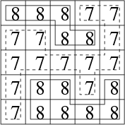
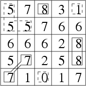

1454：山峰和山谷

时间限制: 1000 ms         内存限制: 65536 KB
提交数: 41     通过数: 15
【题目描述】

给定一个 n×n
的网格状地图，每个方格 (i,j)有一个高度 wij

​​ 。如果两个方格有公共顶点，则它们是相邻的。

定义山峰和山谷如下：

均由地图上的一个连通块组成；

所有方格高度都相同；

周围的方格（即不属于山峰或山谷但与山峰或山谷相邻的格子）高度均大于山谷的高度，或小于山峰的高度。

求地图内山峰和山谷的数量。特别地，如果整个地图方格的高度均相同，则整个地图既是一个山谷，也是一个山峰。
【输入】

第一行一个整数n（2≤n≤10002≤n≤10002≤n≤1000）

，表示地图的大小。

接下来 n
行每行 n 个整数表示地图。第 i 行有 n 个整数 wi1,wi2,…,win(0≤wij≤1 000 000 000)，表示地图第 i

行格子的高度。
【输出】

输出一行两个整数，分别表示山峰和山谷的数量。
【输入样例】

```
5
8 8 8 7 7
7 7 8 8 7
7 7 7 7 7
7 8 8 7 8
7 8 8 8 8
```

【输出样例】

2 1

【提示】

样例1解释：



样例输入2:

```
5
5 7 8 3 1
5 5 7 6 6
6 6 6 2 8
5 7 2 5 8
7 1 0 1 7
```

样例输出2:

3 3

样例2解释：



【来源】

No

## 方法1

```cpp
#include <cstdio>
#include <cstring>
#include <iostream>
#include <algorithm>
#define M 1010
using namespace std;
int n,ans1,ans2,a[M][M];
bool flag,v[M][M];
/*
void Floodfill(int x,int y)
{
	static const int dx[]={-1,-1,-1,0,0,1,1,1};
	static const int dy[]={-1,0,1,-1,1,-1,0,1};
	int i;
	v[x][y]=true;
	for(i=0;i<8;i++)
	{
		int xx=x+dx[i],yy=y+dy[i];
		if(xx<=0||yy<=0||xx>n||yy>n)
			continue;
		if(a[xx][yy]>a[x][y])
			flag=false;
		if(a[xx][yy]==a[x][y]&&!v[xx][yy])
			Floodfill(xx,yy);
	}
}
*/
void Floodfill(int x,int y)
{
	static const int dx[]={-1,-1,-1,0,0,1,1,1};
	static const int dy[]={-1,0,1,-1,1,-1,0,1};
	static pair<int,int> q[M*M];
	int i,r=0,h=0;
	v[x][y]=true,q[++r]=make_pair(x,y);
	while(r!=h)
	{
		x=q[h+1].first;
		y=q[h+1].second;
		q[++h]=make_pair(0,0);
		for(i=0;i<8;i++)
		{
			int xx=x+dx[i],yy=y+dy[i];
			if(xx<=0||yy<=0||xx>n||yy>n)
				continue;
			if(a[xx][yy]>a[x][y])
				flag=false;
			if(a[xx][yy]==a[x][y]&&!v[xx][yy])
				v[xx][yy]=true,q[++r]=make_pair(xx,yy);
		}
	}
}
int main()
{
	int i,j;
	cin>>n;
	for(i=1;i<=n;i++)
		for(j=1;j<=n;j++)
			scanf("%d",&a[i][j]);
	for(i=1;i<=n;i++)
		for(j=1;j<=n;j++)
			if(!v[i][j])
			{
				flag=true;
				Floodfill(i,j);
				ans1+=flag;
			}
	memset(v,0,sizeof v);
	for(i=1;i<=n;i++)
		for(j=1;j<=n;j++)
			a[i][j]=-a[i][j];
	for(i=1;i<=n;i++)
		for(j=1;j<=n;j++)
			if(!v[i][j])
			{
				flag=true;
				Floodfill(i,j);
				ans2+=flag;
			}
	cout<<ans1<<' '<<ans2<<endl;
	return 0;
}
```

## 方法2

```cpp
#include<queue>
#include<cstdio>
#include<cstring>
#include<algorithm>
using namespace std;
struct node{
	int hang,line,val;
};
int d[8][2]={{-1,-1},{-1,0},{-1,1},{0,-1},{0,1},{1,-1},{1,0},{1,1}};
int ch[1010][1010],n,top,under;
bool vis[1010][1010];
int main()
{
//	freopen("int.txt","r",stdin);
//	freopen("my.txt","w",stdout);
	int i,j;
	scanf("%d",&n);
	for(i=1;i<=n;++i)
	 for(j=1;j<=n;++j)
	  scanf("%d",&ch[i][j]);
	for(i=1;i<=n;++i)
	 for(j=1;j<=n;++j)
	  if(!vis[i][j])
	   {
	   	queue<node>que;
	   	node a; a.hang=i; a.line=j; a.val=ch[i][j];
	   	int up=0,down=0; vis[i][j]=1; que.push(a);
	   	while(!que.empty())
	   	 {
	   	 	node u=que.front(); que.pop();
	   	 	int x=u.hang,y=u.line,v=u.val;
	   	 	for(int k=0;k<8;++k)
	   	 	 {
	   	 	 	int xx=x+d[k][0],yy=y+d[k][1];
	   	 	 	if(xx>0&&xx<=n&&yy>0&&yy<=n)
	   	 	 	 {
	   	 	 	 	if(!vis[xx][yy]&&ch[xx][yy]==v)
	   	 	 	 	 {
	   	 	 	 	 	node b; b.hang=xx; b.line=yy; b.val=v;
	   	 	 	 	 	que.push(b); vis[xx][yy]=1;
					 }
					if(ch[xx][yy]<v) down++;
					if(ch[xx][yy]>v) up++;
				 }
			}
	     }
	    if(up&&down) continue;
	     else 
	      if(up&&!down) under++;
	       else 
	        if(!up&&down) top++;
	   }
	if(!under&&!top) printf("1 1\n");
	 else printf("%d %d\n",top,under);
	return 0;
}
```
